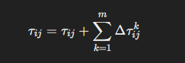

# Ant Colony Optimization (ACO)

## Overview

Ant Colony Optimization (ACO) is an innovative and robust optimization algorithm inspired by the foraging behavior of ants in nature. Developed by Marco Dorigo in the early 1990s, ACO simulates how ants find the shortest paths to food sources using pheromone trails. This nature-inspired approach has proven highly effective in solving a wide range of complex optimization problems.


## Key Concepts

1. **Biological Inspiration:**
   - **Natural Behavior:** ACO is inspired by the way real ants search for food and find the shortest paths between their nest and food sources. Ants communicate indirectly via pheromones, a chemical they deposit on the ground as they travel.
   - **Pheromone Trails:** When an ant finds food, it returns to the nest, leaving a pheromone trail. Other ants probabilistically follow stronger pheromone trails, reinforcing successful paths.

2. **Algorithm Structure:**
   - **Initialization:** A set of artificial ants is initially placed on the nodes of a graph representing the problem to be solved. 
   - **Construction Phase:** Each ant builds a solution by moving from one node to another based on pheromone strength and heuristic information, such as distance or cost.
   - **Pheromone Update:** Once all ants have completed their solutions, pheromone levels on the paths are updated. Paths used by better solutions receive more pheromone, increasing their likelihood of being chosen in future iterations, while pheromones on less optimal paths evaporate.

3. **Probabilistic Path Selection:**
   - **Transition Rule:** Ants move from node to node based on a probability rule that favors paths with higher pheromone concentration and lower heuristic cost. The probability P_ij of moving from node i to node j is given by:

   

     where tau_ij is the pheromone level on path i to j, eta_ij is the heuristic value (e.g., inverse of distance), and alpha and beta are parameters that control the influence of pheromone and heuristic value, respectively.

4. **Pheromone Update Mechanism:**
   - **Pheromone Evaporation:** To avoid unlimited accumulation of pheromone, a fraction of the pheromone on each path evaporates in each iteration, reducing its intensity over time.
   - **Pheromone Deposition:** After completing their tours, ants deposit pheromone on the paths they used. The amount of pheromone deposited can be inversely proportional to the tour length, reinforcing shorter paths.

## Process of Ant Colony Optimization (ACO)

1. **Initialization:**
   - **Pheromone Initialization:** Set initial pheromone levels on all paths to a small positive constant. This ensures that all paths have a chance to be explored initially.
   - **Parameter Setting:** Choose values for algorithm parameters such as the number of ants, the pheromone evaporation rate rho, the importance of pheromone alpha, the importance of heuristic information beta, and the number of iterations or stopping criteria.
   - **Ant Placement:** Place each ant on a randomly selected starting node.

2. **Construct Solutions:**
   - **Ant Movement:** Each ant constructs a solution by moving from node to node. The probability P_ij of an ant moving from node i to node j is influenced by the amount of pheromone on the path tau_ij and the heuristic information eta_ij (e.g., the inverse of distance for TSP):

   

   - **Solution Construction:** Ants probabilistically choose the next node based on P_ij and continue until they have visited all nodes (for TSP) or constructed a complete solution (for other problems).

3. **Pheromone Update:**
   - **Evaporation:** Reduce the pheromone levels on all paths to simulate evaporation, preventing the indefinite accumulation of pheromone:

     

   - **Deposition:** After all ants have constructed their solutions, update the pheromone levels based on the quality of the solutions. Better solutions deposit more pheromone, reinforcing those paths:

   

     where  Delta*tau_{ij}^k is the amount of pheromone deposited by the \(k\)-th ant, typically defined as inversely proportional to the length of the tour or the cost of the solution.

4. **Local Search (Optional):**
   - **Improvement:** Optionally apply a local search algorithm to the solutions constructed by the ants to further refine and improve them.

5. **Check Termination:**
   - **Stopping Criteria:** If the maximum number of iterations is reached or a satisfactory solution is found, terminate the algorithm.
   - **Loop:** Otherwise, return to step 2 and continue with the next iteration.

## Pseudocode for Ant Colony Optimization (ACO)

```plaintext
Initialize pheromone levels on all paths
Set algorithm parameters (number of ants, pheromone evaporation rate, α, β, etc.)

While termination criterion not met:
    For each ant in the colony:
        Place the ant on a randomly selected node
        While the solution is not complete:
            Select the next node based on probability influenced by pheromone and heuristic information
            Move the ant to the selected node and add the node to the solution
        End While
    End For
    
    Update pheromone levels:
        For each path:
            Evaporate a fraction of the pheromone
        End For
        
        For each ant's solution:
            Deposit pheromone on the paths used in the solution, proportional to the quality of the solution
        End For
        
    If a local search procedure is used:
        Apply local search to improve the solutions
    End If
End While

Return the best solution found
```

## ACO Flowchart


## Advantages of Ant Colony Optimization (ACO)

1. **Robustness:**
   - **Solution Quality:** ACO is robust and can find high-quality solutions for a variety of complex optimization problems.
   - **Versatility:** The algorithm can be adapted to a wide range of problems, including combinatorial optimization problems like the Traveling Salesman Problem (TSP), Vehicle Routing Problem (VRP), and network routing.

2. **Parallelism:**
   - **Efficiency:** ACO is inherently parallel, as multiple ants explore the search space simultaneously. This parallelism can be exploited to improve computational efficiency, especially on modern multi-core processors or distributed computing systems.

3. **Positive Feedback:**
   - **Reinforcement:** Good solutions are reinforced through pheromone updates, guiding future search efforts towards promising regions of the search space. This positive feedback mechanism helps the algorithm to converge towards optimal or near-optimal solutions.

4. **Adaptability:**
   - **Dynamic Changes:** ACO can adapt to dynamic changes in the problem environment, making it suitable for real-time applications where the problem conditions may change over time (e.g., dynamic network routing).

## Disadvantages of Ant Colony Optimization (ACO)

1. **Computational Cost:**
   - **Resource Intensity:** ACO can be computationally expensive, particularly for large problems, due to the need for multiple iterations and pheromone updates. The computational cost increases with the number of ants and the size of the problem.

2. **Parameter Sensitivity:**
   - **Tuning Required:** The performance of ACO depends on careful tuning of parameters such as the pheromone evaporation rate (\(\rho\)), the importance of pheromone (\(\alpha\)), and the importance of heuristic information (\(\beta\)). Improper parameter settings can lead to poor performance or slow convergence.

3. **Convergence Speed:**
   - **Slow Convergence:** ACO may converge slowly, especially on very large or complex problems. The algorithm can sometimes get stuck in local optima, especially if the pheromone evaporation rate is too low or the balance between exploration and exploitation is not well managed.

4. **Scalability:**
   - **Efficiency Issues:** As the problem size increases, the number of paths and the pheromone updates grow, potentially reducing efficiency. For very large-scale problems, the computational overhead can become significant, making it challenging to apply ACO effectively without optimization techniques or hybrid approaches.

Ant Colony Optimization's ability to mimic natural processes for solving complex problems makes it a powerful tool, but its effectiveness requires careful parameter tuning and may come with significant computational costs.

## Applications

1. **Traveling Salesman Problem (TSP):**
   - ACO is highly effective in finding near-optimal solutions to the TSP, where the objective is to find the shortest possible route that visits each city exactly once and returns to the origin city.

2. **Vehicle Routing Problem (VRP):**
   - ACO optimizes routes for a fleet of vehicles delivering goods to various locations, minimizing total travel distance or time while considering constraints like vehicle capacity and delivery windows.

3. **Network Routing:**
   - ACO is used to determine the most efficient paths for data packets in communication networks, enhancing speed and reliability by dynamically adapting to changing network conditions.

4. **Scheduling:**
   - ACO is applied to various scheduling problems, including job shop scheduling, project scheduling, and task allocation, optimizing resource use and minimizing completion time.

## Conclusion

Ant Colony Optimization leverages the collective intelligence and pheromone-based communication of ants to solve complex optimization problems. By mimicking the natural behavior of ants, ACO effectively explores and exploits the search space, making it a versatile and robust tool for a wide range of applications in fields such as logistics, telecommunications, and manufacturing.
